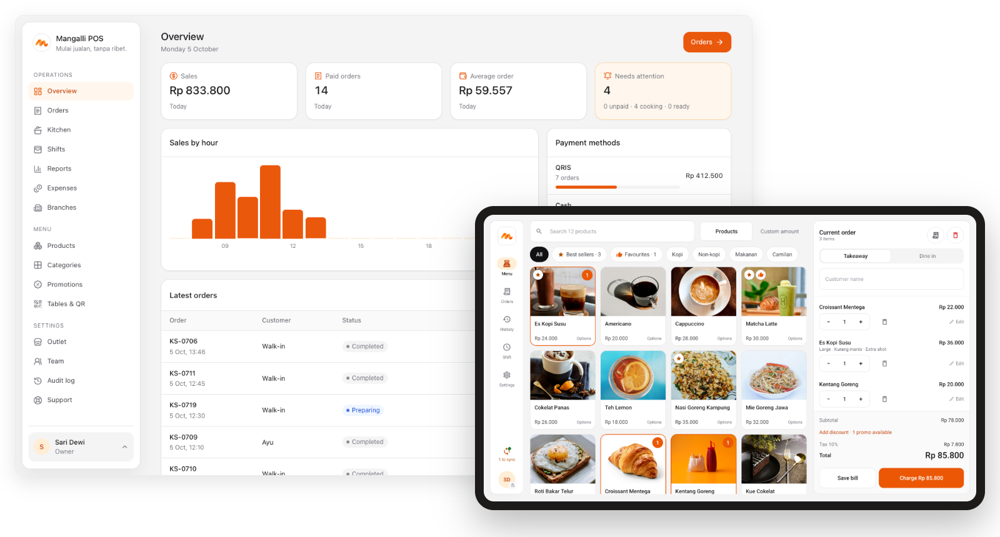
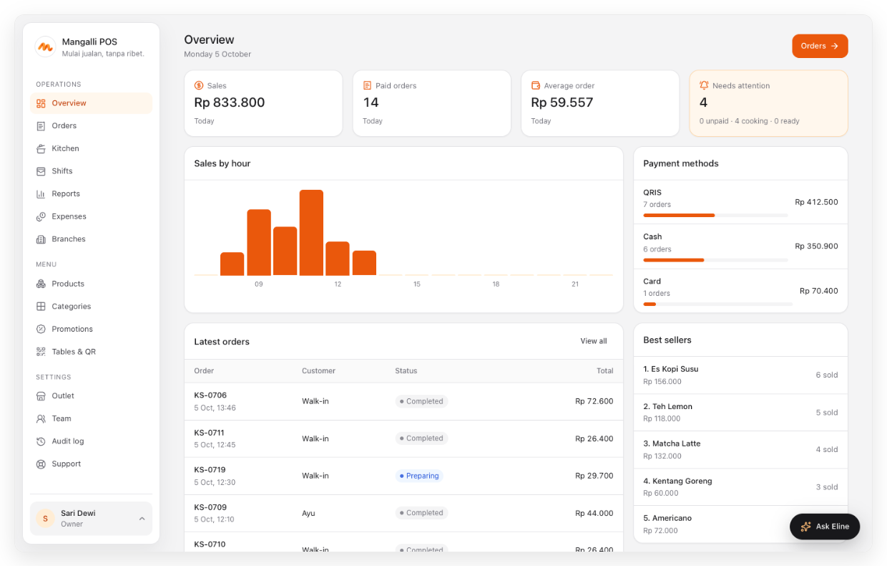
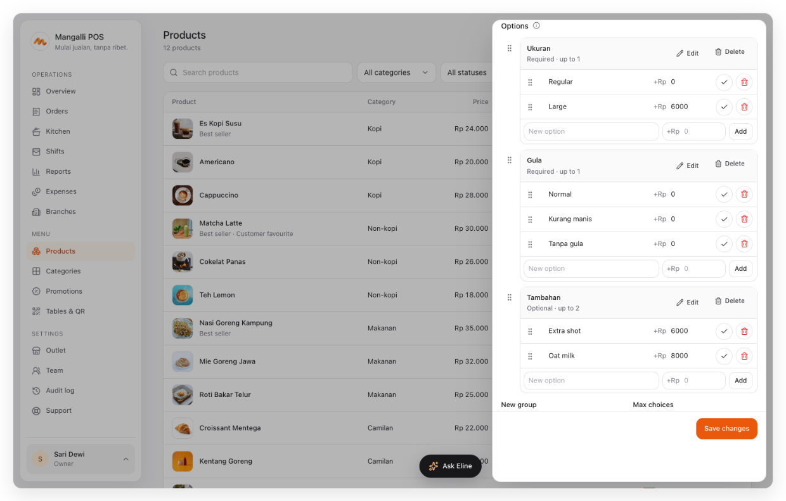
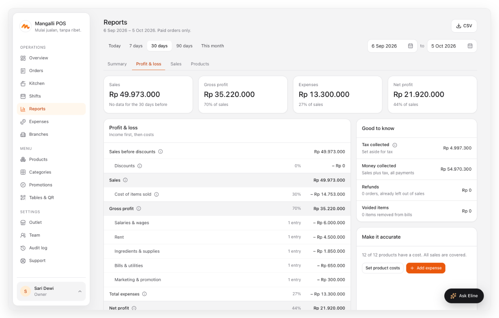
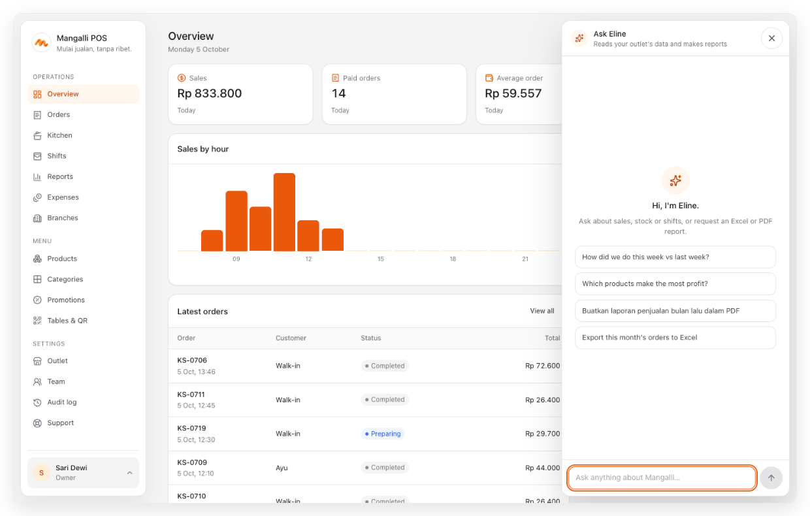
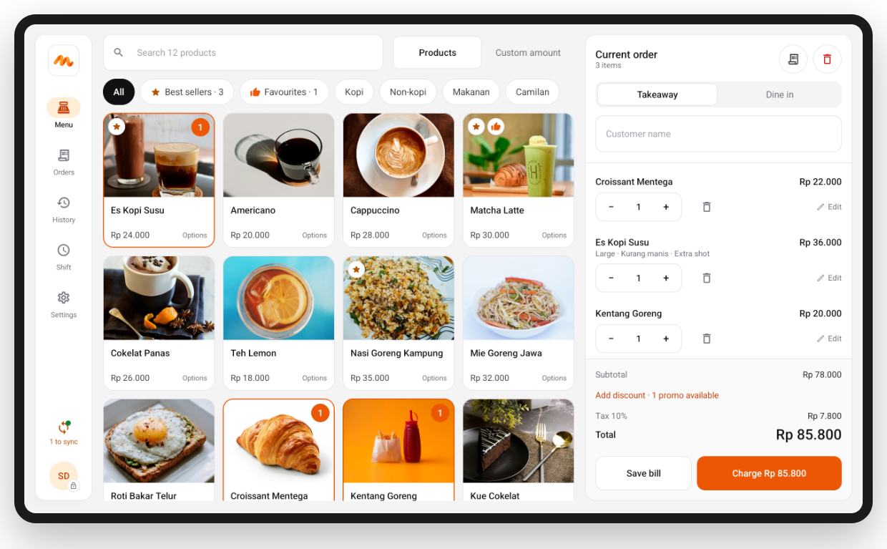
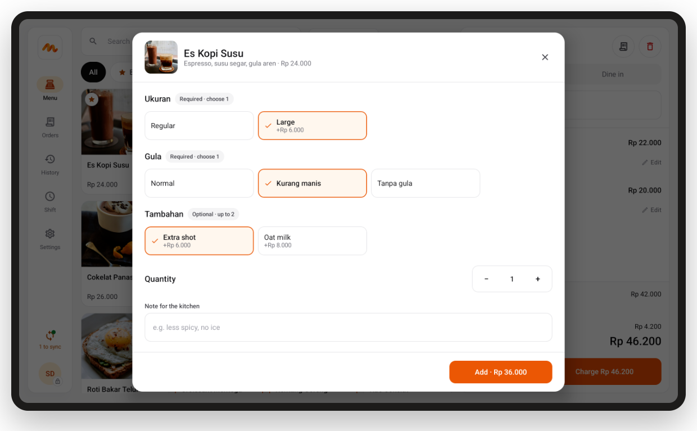
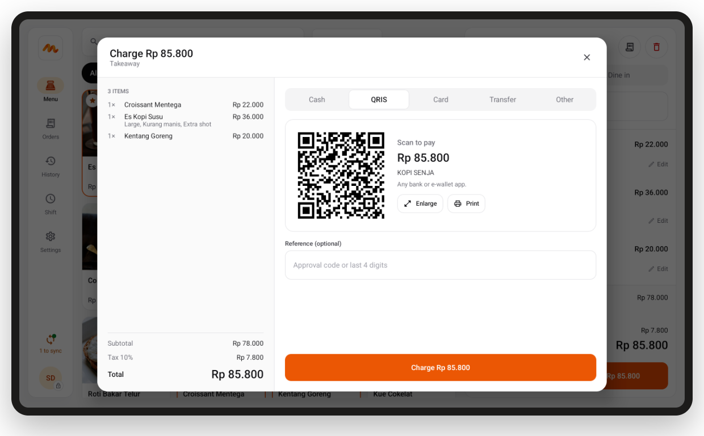
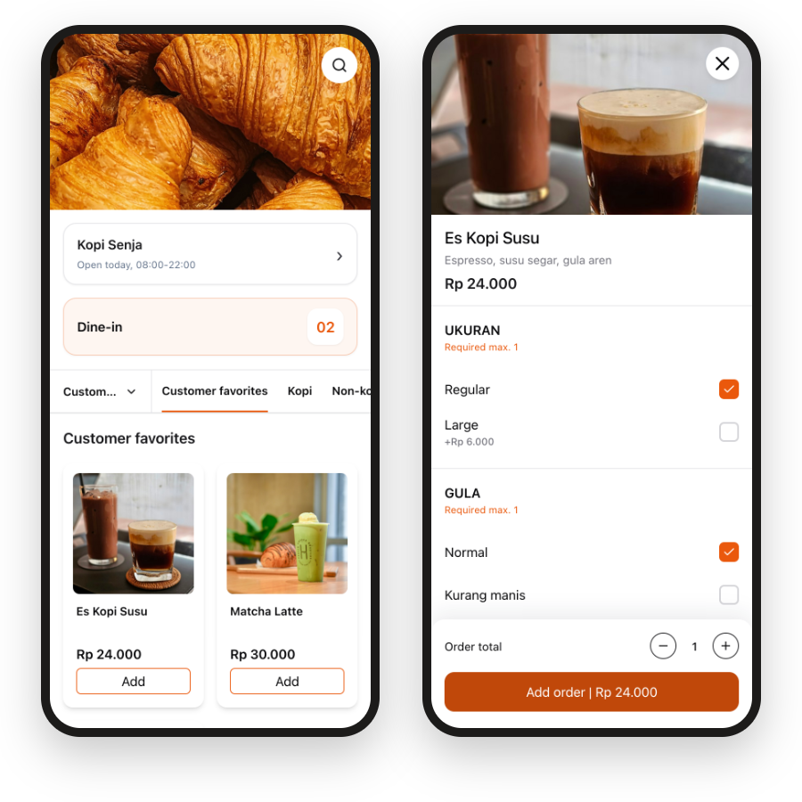

<div align="center">


# Mangalli POS

**Point of sale for cafés and restaurants.**<br>
A web dashboard for the owner and an Android cashier app that keeps selling without internet.

[](LICENSE)
[](#self-host)
[](https://mangalli.web.id)

[Self-host](#self-host) · [Free or hosted](#free-or-hosted) · [Screenshots](#a-look-inside) · [mangalli.web.id](https://mangalli.web.id)

<br>



</div>

## Why Mangalli

- **Built for the counter.** A landscape tablet app with large buttons, Bluetooth receipt and kitchen printers, and QRIS shown on screen or printed on the receipt.
- **Keeps working offline.** Orders, payments and shifts are saved on the tablet and sync when the connection returns.
- **Numbers owners understand.** Sales, profit and loss, best sellers and a daily email, written in plain words.
- **Yours to run.** Every feature is in this repository. Self-host it for free, or let 1garis Studio run it for you.

## Free or hosted

|  | **Self-host** | **Hosted by 1garis Studio** |
| --- | --- | --- |
| Price | Free | Rp99.000 per outlet per month<br><sub>Rp990.000 per year</sub> |
| Dashboard, tablet app, reports, branches, promotions | ✓ Every feature | ✓ Every feature |
| Server, HTTPS and backups | You run them | Managed for you |
| Updates | Pull and rebuild | Automatic |
| Cashier tablet app | Build and sign your own APK | Ready to install, updates inside the app |
| Ask Eline (AI assistant, menu import) | Your own OpenAI-compatible key | Included |
| Online payments (Midtrans) | Your own Midtrans keys | Your Midtrans account, set up together |
| Photo uploads | Your own S3, R2 or MinIO | Included |
| Daily report email | Your own SMTP | Included |
| Extra branch | Free | Rp49.000 per month |
| Digital menu (QR ordering) | Not included | Add-on, Rp79.000 per outlet per month |
| Support | GitHub issues | WhatsApp |

Hosted plans start with a 14-day trial at [mangalli.web.id](https://mangalli.web.id). Need help installing on your own server? 1garis Studio also offers a one-time setup.

## A look inside

### Dashboard

<table>
  <tr>
    <td width="50%" valign="top"><br><b>Overview</b><br><sub>Today's sales, payment methods, best sellers and live orders.</sub></td>
    <td width="50%" valign="top"><br><b>Menu and options</b><br><sub>Sizes, sugar levels and add-ons, reordered by dragging.</sub></td>
  </tr>
  <tr>
    <td width="50%" valign="top"><br><b>Profit and loss</b><br><sub>Income first, then costs, with CSV export.</sub></td>
    <td width="50%" valign="top"><br><b>Ask Eline</b><br><sub>Ask about your numbers or turn a menu photo into products.</sub></td>
  </tr>
</table>

### Cashier tablet



<table>
  <tr>
    <td width="50%" valign="top"><br><b>Options in one tap</b><br><sub>Sizes, sugar and extras, with prices shown upfront.</sub></td>
    <td width="50%" valign="top"><br><b>QRIS on screen</b><br><sub>A dynamic QRIS with the exact amount, or printed on the receipt.</sub></td>
  </tr>
</table>

### Digital menu <sub>hosted add-on</sub>

<p align="center"></p>

Customers scan the table QR, choose their options and pay from their phone. Orders arrive on the tablet and in the kitchen. The digital menu is a hosted service and is not part of this repository; the dashboard exposes the menu and order API it uses.

## Self-host

Requirements: Docker with Compose.

```bash
git clone https://github.com/xmbshub/mangalli.git
cd mangalli
cp apps/mangalli-pos/.env.example .env
```

Fill in `.env`: at least `POS_SESSION_SECRET`, `POS_OWNER_EMAIL`,
`POS_OWNER_PASSWORD` and `MANGALLI_PUBLIC_URL`. Then:

```bash
docker compose up -d --build
docker compose exec pos pnpm db:seed
```

Open `http://localhost:4107` and sign in with outlet code `demo` and the owner
email and password from `.env`. Put the dashboard behind HTTPS (Caddy, Nginx or
a tunnel) before connecting tablets.

### Optional services

Every outside service uses your own account and key. Leave a variable empty to
turn that feature off.

| Feature | Variables |
| --- | --- |
| Ask Eline, menu import | `MANGALLI_ROUTER_URL`, `MANGALLI_ROUTER_KEY`, `MANGALLI_ROUTER_MODEL` (any OpenAI-compatible endpoint) |
| Online payments | `MIDTRANS_SERVER_KEYS_JSON`, `MIDTRANS_IS_PRODUCTION` |
| Photo uploads | `R2_*` (Cloudflare R2, MinIO or S3) |
| Daily report email | `SMTP_*` |

### Cashier tablet

Build the APK for your server (Android SDK and JDK 17):

```bash
cd apps/mangalli-pos/android-pos
./gradlew assembleRelease -PmangalliServerUrl=https://pos.example.com
```

Sign it with your own key (see `apps/mangalli-pos/android-pos/README.md`) and
keep that key: tablets only accept updates signed with the same key.

## Development

```bash
pnpm install
docker compose up -d db   # or any PostgreSQL; set DATABASE_URL in apps/mangalli-pos/.env.local
pnpm db:migrate && pnpm db:seed
pnpm dev
```

Checks: `pnpm typecheck`, `pnpm lint`, `pnpm test`, and `./gradlew testDebugUnitTest`
in `apps/mangalli-pos/android-pos`.

## Contributing

This repository is published from the 1garis Studio monorepo. Issues and pull
requests are welcome; accepted changes are applied there and appear here with
the next sync.

## License

GNU Affero General Public License v3.0. See [LICENSE](LICENSE).
Screenshots use demo data; product photos are from [Unsplash](https://unsplash.com).
